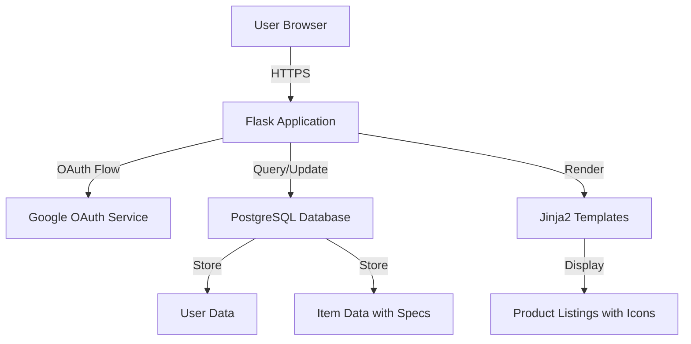
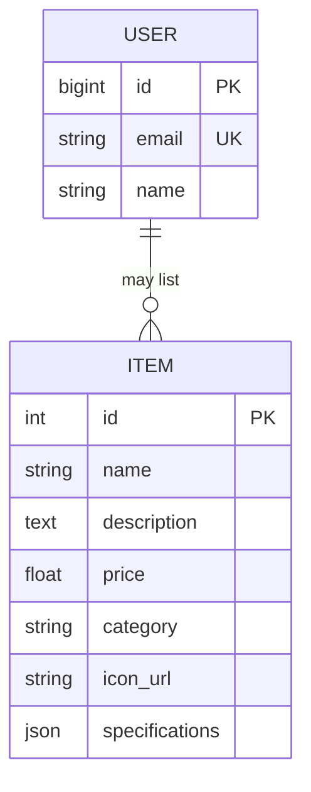

# Design Document

## Overview

This design document outlines the technical approach for enhancing the marketplace application with improved Google OAuth authentication and enriched product listings. The solution builds upon the existing Flask application with SQLAlchemy ORM, extending the data model to support product images and category-specific specifications while refining the OAuth flow for better reliability.

The design focuses on:
- Ensuring robust Google OAuth authentication with proper session management
- Extending the database schema to support product icons and specifications
- Creating reusable template components for displaying category-specific product details
- Maintaining the existing Tailwind CSS styling approach for consistency

## Architecture

### System Components



### Technology Stack

- **Backend Framework**: Flask with Flask-Login for session management
- **Authentication**: Authlib OAuth client for Google OAuth 2.0
- **Database**: PostgreSQL with SQLAlchemy ORM
- **Frontend**: Jinja2 templates with Tailwind CSS
- **Session Storage**: Flask sessions with 7-day persistence

## Components and Interfaces

### 1. Authentication Component

#### Google OAuth Flow Enhancement

The existing OAuth implementation will be refined to ensure proper error handling and session management:

**OAuth Configuration** (existing, to be verified):
- Client ID and Secret from environment variables
- Redirect URI: `/auth` endpoint
- Scopes: `openid email profile`
- Discovery URL for automatic endpoint configuration

**Login Flow**:
1. User clicks "Sign in with Google" button
2. System generates nonce for CSRF protection
3. Redirect to Google authorization page
4. Google redirects back to `/auth` with authorization code
5. Exchange code for access token
6. Retrieve user info (id, email, name)
7. Create or retrieve user from database
8. Establish Flask-Login session
9. Redirect to home page

**Session Management**:
- Permanent sessions enabled with 7-day lifetime
- Flask-Login handles session persistence
- Logout clears session and redirects to login

### 2. Data Model Extensions

#### Enhanced Item Model

The current `Item` model will be extended to support icons and category-specific specifications:

```python
class Item(db.Model):
    __tablename__ = 'items'
    
    # Existing fields
    id = db.Column(db.Integer, primary_key=True)
    name = db.Column(db.String(100), nullable=False)
    description = db.Column(db.Text)
    price = db.Column(db.Float, nullable=False)
    category = db.Column(db.String(50), nullable=False)
    
    # New fields
    icon_url = db.Column(db.String(500))  # URL or path to image
    
    # Category-specific specifications stored as JSON
    specifications = db.Column(db.JSON)
```

**Specification Schema by Category**:

**Furniture**:
```json
{
  "material": "string",
  "dimensions": "string (e.g., '72x36x30 inches')",
  "condition": "string (new/used/refurbished)"
}
```

**Cars**:
```json
{
  "year": "integer",
  "make": "string",
  "model": "string",
  "mileage": "integer",
  "condition": "string (new/used/certified)"
}
```

**Houses**:
```json
{
  "bedrooms": "integer",
  "bathrooms": "float",
  "square_footage": "integer",
  "location": "string (city, state)"
}
```

#### User Model

The existing User model remains unchanged:
```python
class User(UserMixin, db.Model):
    id = db.Column(BIGINT, primary_key=True)
    email = db.Column(db.String(100), unique=True)
    name = db.Column(db.String(100))
```

### 3. Template Design

#### Product Card Component

A reusable product card structure will be implemented across all category templates:

**Visual Layout**:
```
┌─────────────────────────┐
│                         │
│    [Product Icon]       │
│                         │
├─────────────────────────┤
│  Product Name           │
│  Description            │
│                         │
│  Specifications:        │
│  • Spec 1: Value        │
│  • Spec 2: Value        │
│  • Spec 3: Value        │
│                         │
│  Price: $X,XXX.XX       │
└─────────────────────────┘
```

**Template Structure**:
- Icon displayed at top with fixed aspect ratio (e.g., 16:9)
- Fallback to category-specific placeholder if icon_url is null
- Specifications rendered dynamically based on category
- Price formatted consistently with 2 decimal places
- Responsive grid layout (1 column mobile, 3 columns desktop)

#### Category-Specific Templates

Each category template (furniture.html, cars.html, houses.html) will:
- Query items filtered by category
- Pass items to template with specifications
- Render product cards with category-appropriate spec labels
- Use consistent styling via Tailwind CSS classes

### 4. Route Handlers

#### Authentication Routes

**`/login` (GET)**:
- Generates nonce for CSRF protection
- Stores nonce in session
- Redirects to Google OAuth authorization URL

**`/auth` (GET)**:
- Receives authorization code from Google
- Exchanges code for access token
- Retrieves user info from Google API
- Creates or retrieves User record
- Calls `login_user()` to establish session
- Redirects to home page

**`/logout` (GET)**:
- Calls `logout_user()` to clear session
- Redirects to login page

#### Category Routes

**`/furniture`, `/cars`, `/houses` (GET)**:
- Requires authentication via `@login_required` decorator
- Queries items by category
- Passes items to respective template
- Returns rendered HTML

## Data Models

### Database Schema



**Migration Strategy**:
1. Add `icon_url` column (nullable)
2. Add `specifications` column as JSONB (nullable)
3. Existing items will have null values initially
4. Populate with default placeholders or actual data

### Specification Access Pattern

```python
# Accessing specifications in Python
item = Item.query.get(item_id)
if item.category == 'furniture':
    material = item.specifications.get('material')
    dimensions = item.specifications.get('dimensions')
elif item.category == 'cars':
    year = item.specifications.get('year')
    mileage = item.specifications.get('mileage')
```

## Error Handling

### Authentication Errors

1. **OAuth Failure**: If Google OAuth returns an error, redirect to login page with error message
2. **Token Exchange Failure**: Log error and display user-friendly message
3. **User Creation Failure**: Catch database exceptions and rollback transaction
4. **Session Expiry**: Flask-Login automatically redirects to login page

### Data Access Errors

1. **Missing Specifications**: Use `.get()` with default values to handle missing keys
2. **Invalid JSON**: Validate specifications before saving to database
3. **Missing Icons**: Display category-specific placeholder images
4. **Database Connection**: Flask-SQLAlchemy handles connection pooling and retries

### Template Rendering Errors

1. **Missing Data**: Use Jinja2 default filters (e.g., `{{ item.icon_url | default('placeholder.jpg') }}`)
2. **Null Specifications**: Check for existence before rendering spec fields
3. **Price Formatting**: Use Jinja2 format filter with error handling

## Testing Strategy

### Unit Tests

1. **Model Tests**:
   - Test Item creation with specifications
   - Test specification JSON serialization/deserialization
   - Test User model creation and uniqueness constraints

2. **Route Tests**:
   - Test OAuth callback handling with mock Google responses
   - Test authenticated route access
   - Test category filtering logic

### Integration Tests

1. **Authentication Flow**:
   - Test complete OAuth flow with test credentials
   - Test session persistence across requests
   - Test logout functionality

2. **Product Listing**:
   - Test rendering of items with specifications
   - Test placeholder image fallback
   - Test category-specific specification display

### Manual Testing Checklist

1. **Google OAuth**:
   - [ ] Login with valid Google account
   - [ ] Verify user created in database
   - [ ] Verify session persists after browser close
   - [ ] Test logout functionality

2. **Product Listings**:
   - [ ] Verify icons display correctly
   - [ ] Verify placeholder images for items without icons
   - [ ] Verify specifications display for each category
   - [ ] Verify price formatting
   - [ ] Test responsive layout on mobile and desktop

3. **Error Scenarios**:
   - [ ] Test with invalid OAuth credentials
   - [ ] Test with missing environment variables
   - [ ] Test with database connection failure
   - [ ] Test with malformed specification data

## Security Considerations

1. **OAuth Security**:
   - Use nonce for CSRF protection
   - Validate state parameter in OAuth callback
   - Store client secret in environment variables
   - Use HTTPS in production

2. **Session Security**:
   - Use secure session cookies in production
   - Set appropriate session timeout
   - Implement CSRF protection for state-changing operations

3. **Data Validation**:
   - Validate specification JSON structure before saving
   - Sanitize user inputs in future features
   - Use parameterized queries (SQLAlchemy handles this)

## Performance Considerations

1. **Database Queries**:
   - Index on `category` column for faster filtering
   - Consider pagination for large item lists
   - Use eager loading if relationships are added

2. **Image Loading**:
   - Use lazy loading for product images
   - Consider CDN for image hosting
   - Optimize image sizes for web display

3. **Session Management**:
   - Use server-side sessions for sensitive data
   - Consider Redis for session storage in production
   - Implement session cleanup for expired sessions
